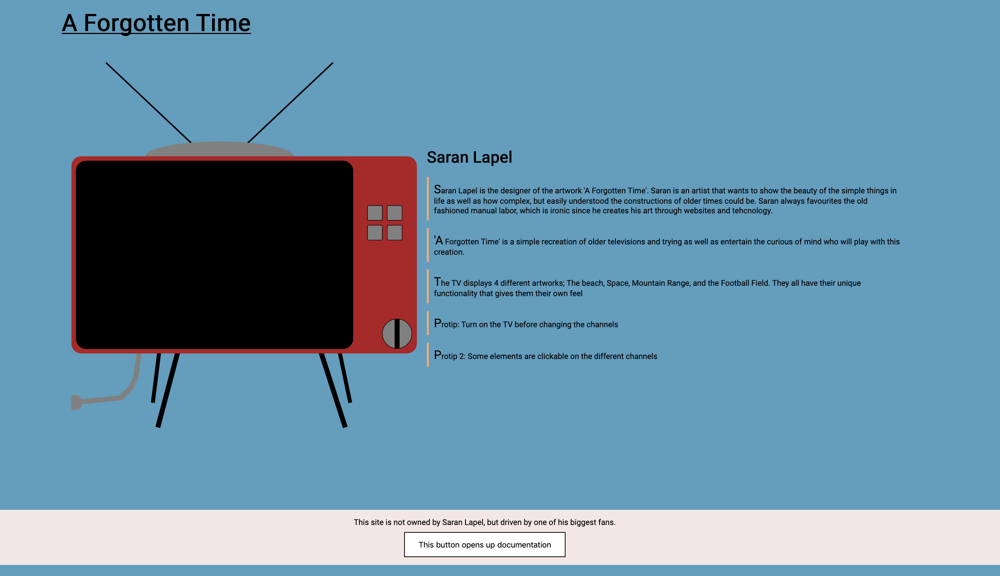
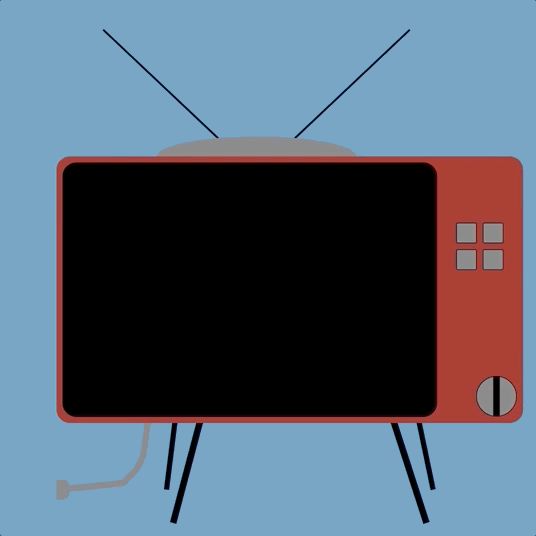
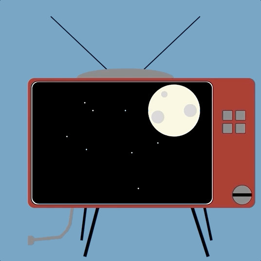
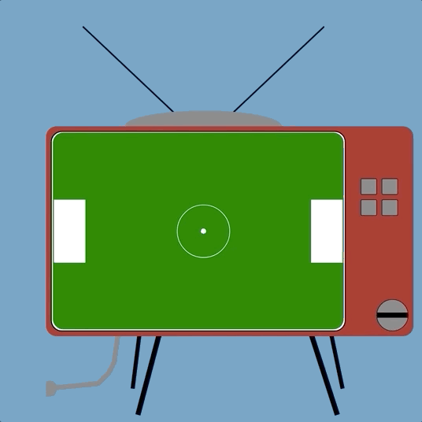

# it2810-prosjekt-1
The first deliverable in the course IT2810 - Web Devlopment. Here the purpose was to build a simple page (art) with interactable SVGs while under a pen name.

It is built with regular HTML, CSS, and Javascript. The main page looks like so:

The TV is interactable where one can turn on the TV, change channels, and interact with some of the objects on the channels.

